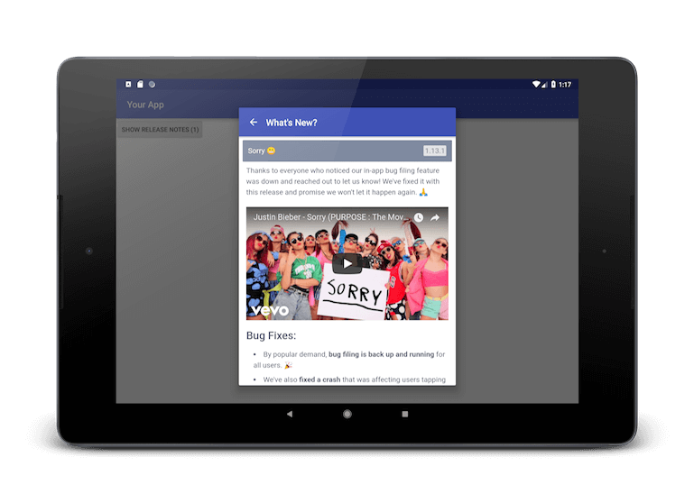

# Appnouncements Android SDK [](https://jitpack.io/#com.appnouncements/appnouncements-android)


The [Appnouncements](https://www.appnouncements.com) Android SDK is the best way to get your release notes in front of your customer's eyes. Use it to inform customers about relevant changes and updates to your app.

Phone | Error | Tablet
:-------------------------:|:-------------------------:|:-------------------------:
  |   | 

## Requirements

- **minSDK:** 15
- **SDK Size:** 64 methods
- **Dependencies:** `appcompat-v7:22.1.0 or higher`
- **Permissions:** `android.permission.INTERNET`

## Integration Guide
### Dependencies
[](https://jitpack.io/#com.appnouncements/appnouncements-android)

In your project's root `build.gradle`, add jitpack as a repository:

```
	allprojects {
		repositories {
			...
			maven { url 'https://jitpack.io' }
		}
	}
```

Add the dependency to your project's `build.gradle`

```
	dependencies {
	  implementation 'com.appnouncements:appnouncements-android:0.1.0'
	}
```

**Note: If you already include appcompat-v7, you will likely run into version incompatabilities. To resolve these, see our [troubleshooting section](https://github.com/Appnouncements/appnouncements-android#troubleshooting).**

### Application Integration
In your [Application Class](https://github.com/codepath/android_guides/wiki/Understanding-the-Android-Application-Class#defining-your-application-class), initialize Appnouncements with the SDK key that can be found in your dashboard.

```
public class MyApplication extends Application {
    @Override
    public void onCreate() {
        super.onCreate();
        Appnouncements.initialize(this, "YOUR API KEY HERE");
    }
}
```

Retrieve an instance of the Appnouncements' `Client` by calling `Appnouncements.getClientAsync` and implementing our `Client.Listener` interface.
```
public class MainActivity extends AppCompatActivity implements Client.Listener {
    @Override
    protected void onResume() {
        super.onResume();
        Appnouncements.getClientAsync(this);
    }

    @Override
    public void onAppnouncementsClientReady(Client client) {
        client.showReleaseNotes(this);
    }

    @Override
    public void onAppnouncementsClientFailed(AppnouncementsException error) {
    }
}
```

## API Docs
### Appnouncements
`initialize(Application applicationContext, String apiKey)`

Initializes the SDK. This should be done in your Application's `onCreate`

`getClientAsync(Client.Listener callback)`

Asynchronously gets an Appnouncements client. The client instance will be cached for the duration of the app.

In the event of any failures (invalid API key, Appnouncements is down, etc), you will receive an exception in your `onAppnouncementsClientFailed` handler.

### Client
`getUnseenReleaseNotesCount()`

Returns the number of "unseen" release notes from when the app was last launched. This could be used to implement a badge on your Release Notes button.

`showReleaseNotes(Activity activity)`

Opens the release notes on top of your current activity (fullscreen on mobile, dialog on tablet) with an action bar title of "What's new?"

`showReleaseNotes(Activity activity, @StringRes int actionbarTitle)`

Opens the release notes on top of your current activity (fullscreen on mobile, dialog on tablet) with a custom action bar title

## Theming
### Light ActionBar
If your application is using a light colored actionbar, you shouldn't need to make any changes.

### Dark ActionBar
If your application is using a dark colored actionbar, you can update your `AndroidManifest.xml` to use our dark theme.

```
<activity android:name="com.appnouncements.sdk.ui.ReleaseNotesActivity"
  tools:replace="android:theme"
  android:theme="@style/Theme.Appnouncements.Dark.Toolbar" />
```

### Overriding Toolbar Colors
Create a new style by overriding one of our Appnouncements' styles (e.g. `Theme.Appnouncements.Light.Toolbar` or `Theme.Appnouncements.Dark.Toolbar`).

```
    <style name="Theme.Appnouncements.Dark.Toolbar.Override" parent="Theme.Appnouncements.Dark.Toolbar">
        <item name="colorPrimary">@color/colorPrimary</item>
        <item name="colorPrimaryDark">@color/colorPrimaryDark</item>
        <item name="colorAccent">@color/colorAccent</item>
        <item name="android:textColorPrimary">#FF0000</item>
    </style>
```

Update your `AndroidManifest.xml` to use the new style.
```
<activity android:name="com.appnouncements.sdk.ui.ReleaseNotesActivity"
  tools:replace="android:theme"
  android:theme="@style/Theme.Appnouncements.Dark.Toolbar.Override" />
```

## Troubleshooting
> Android dependency 'com.android.support:appcompat-v7' has different version for the compile (...) and runtime (...) classpath. You should manually set the same version via DependencyResolution

Fix 1 **(Recommended)**: Force appcompat-v7 dependency resolution to the one specified in your build.gradle which causes all your dependencies to rely on the same appcompat version.
```
  dependencies {
    implementation ('com.android.support:appcompat-v7:22.1.0') { force = true }
    implementation 'com.github.Appnouncements:appnouncements-android:881ff1e18f'
  }
```

Fix 2: Exclude the appcompat modules from Appnouncements
```
  dependencies {
    implementation 'com.android.support:appcompat-v7:22.1.0'
    implementation ('com.appnouncements:appnouncements-android:0.1.0') { exclude group: 'com.android.support' }
  }
```
